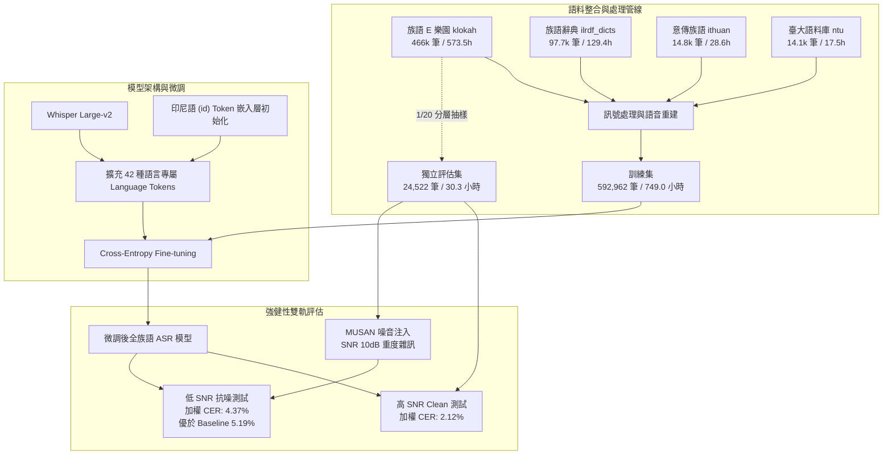
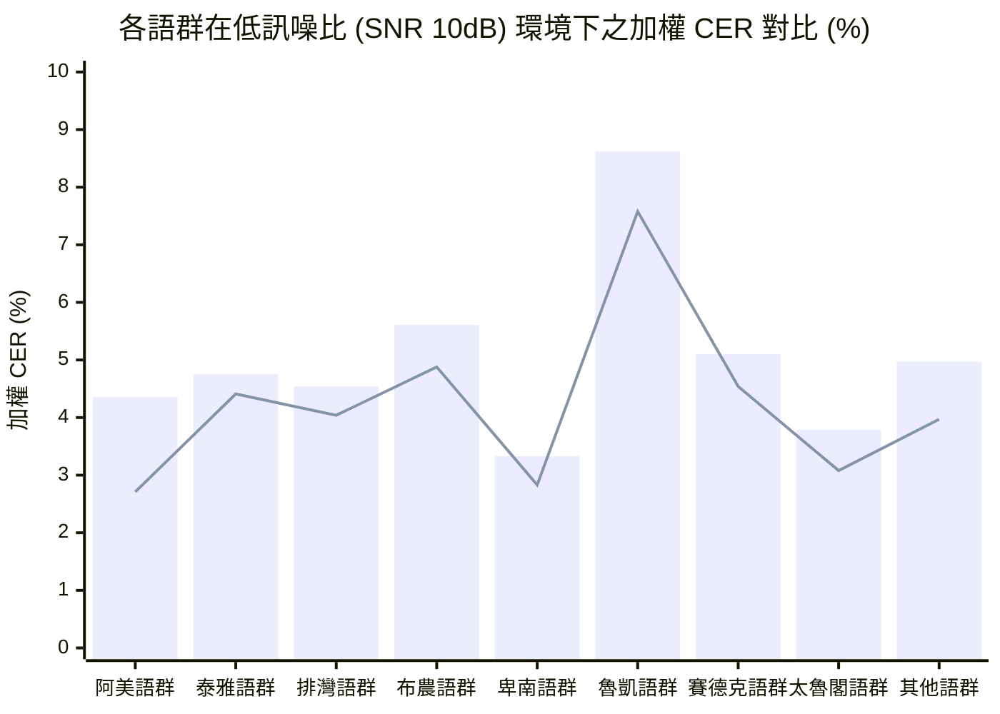

# 臺灣原住民族語 AI 計畫：全族語語音辨識（ASR）模型微調與強健性評估報告

> **專案名稱**：臺灣原住民族語 AI 計畫 (Formosan AI Project)  
> **主導單位**：意傳科技  
> **執行單位**：牧仁資訊  
> **報告日期**：2026-09-08  
> **評估模型**：Whisper Large-v2 微調版（42 種語言專屬 Token 擴展）  
> **評估範圍**：臺灣原住民族 16 族 42 語言別（高訊噪比 Clean vs. 低訊噪比 MUSAN 雜訊環境）  

---

## 1. 執行摘要 (Executive Summary)

本報告針對「臺灣原住民族語 AI 計畫」第一階段之**自動語音辨識（Automatic Speech Recognition, ASR）模型**進行微調架構、資料流程、評估基準與實驗成果之深度剖析。

本階段模型基於 OpenAI **Whisper Large-v2** 進行領域深度微調（Fine-tuning），針對臺灣原住民族 **16 個族群、共 42 個語言別** 進行語言符記（Language Token）擴充，並採用同為南島語系之印尼語符記（`<|id|>`）進行嵌入層初始化。語料整合了四大核心資料集（族語 E 樂園、族語辭典、意傳族語、臺大族語語料庫），經過專業訊號處理與語音重建清理後，訓練資料規模達到 **592,962 筆、約 749 小時**。

評估實驗採用「族語 E 樂園（klokah）」各情境教材之分層獨立抽樣集（**24,522 筆、30.27 小時**），分別於**高訊噪比（Clean / 高 SNR）**與**低訊噪比（MUSAN 噪音注入，SNR 10dB）**兩種環境下進行嚴格檢驗：

1. **高訊噪比（Clean）評估表現**：
   - **顯著降低錯誤率**：新模型全體 42 種語言之加權平均正規化字元錯誤率（Normalized CER）由「上一期族語 AI 計畫」Baseline 模型的 **2.77%** 大幅降至 **2.12%**（未加權平均由 **2.91%** 降至 **2.19%**），整體相對錯誤率改善達 **23.6%**。
   - **極高改善涵蓋率**：在評估的 42 種語言中，高達 **40 種語言（95.2%）** 辨識率顯著提升。其中南勢阿美語（CER 由 10.29% 驟降至 1.32%，改善達 87.2%）、茂林魯凱語（CER 由 14.82% 降至 8.64%，改善達 41.7%）、賽夏語（CER 5.12% 降至 2.85%）等均獲突破性進展。
2. **低訊噪比（Low SNR, SNR 10dB）抗噪強健性**：
   - 在注入真實世界重度生活背景噪音（MUSAN, SNR = 10 dB）的壓力測試下，新模型的加權平均 CER 依然強韌維持在 **4.37%**（未加權 4.50%）。
   - 相較於上一期 Baseline 模型在同等 10dB 雜訊環境下的 **5.19%**（未加權 5.37%），新模型在重度雜訊下的錯誤率**相對降低了 15.8%**（絕對值降低 0.82%），證明新模型具備極佳的雜訊免疫力與聲學泛化實用價值。

---

## 2. 專案背景與目標 (Background & Objectives)

臺灣原住民族語言屬於南島語系（Austronesian language family），具備豐富且多樣的音韻與構詞結構。然而，長期以來原住民族語言在國際開源語音模型（如原始 Whisper、Wav2Vec 2.0 等）中屬於極度低資源（Extremely Low-Resource）範疇，缺乏專屬語言符記與針對性聲學優化，致使直接套用開源模型時產生嚴重的辨識偏誤或幻覺輸出。

為解決此一數位鴻溝，由意傳科技主導、牧仁資訊共同執行推動「臺灣原住民族語 AI 計畫」，設定核心工程目標如下：
1. **全語言涵蓋**：完整支援行政院原住民族委員會核定之 16 族、共 42 個語言別，不遺漏任何瀕危極低資源語言。
2. **建立高標基準**：以**上一期族語 AI 計畫所訓練之 Whisper Large-v2 ASR 模型作為對照基準（Baseline）**，本期透過擴大語料規模、精進訊號重建與語言符記設計，進一步推升整體辨識準確率與模型強健性。
3. **驗證抗噪強健性**：克服原鄉學校、部落文化活動、戶外訪談等真實生活中的高背景噪音痛點，驗證模型於低訊噪比環境之可用性。

---

## 3. 語料資料集來源與預處理架構 (Datasets & Preprocessing)

### 3.1 四大語料來源彙整
本計畫彙整臺灣目前最權威且具代表性的四大族語語料庫，涵蓋辭典單詞、教學情境對話、部落田野口述錄音等多種聲學分佈：

| 語料庫來源 | 涵蓋語言數 | 總樣本數 (筆) | 總時長 (小時) | 訓練集 (筆 / 時長) | 評估集 (筆 / 時長) | 主要特性與內容 |
| :--- | :---: | :---: | :---: | :---: | :---: | :--- |
| **族語 E 樂園 (`klokah`)** | 42 | 490,726 | 603.77 | 466,204 / 573.50 hrs | 24,522 / 30.27 hrs | 涵蓋 42 種語言生活情境對話、句型篇章，發音清晰標準，為本計畫主力教材語料 |
| **族語辭典 (`ilrdf_dicts`)** | 16 | 97,785 | 129.42 | 97,785 / 129.42 hrs | 0 / 0.00 hrs | 原住民族語言研究發展基金會詞典音檔，涵蓋核心 16 族之標準詞彙與例句朗讀 |
| **意傳族語 (`ithuan_formosan`)** | 3 | 14,902 | 28.72 | 14,843 / 28.60 hrs | 59 / 0.11 hrs | 意傳科技所錄製的高品質語音，涵蓋太魯閣語、德固達雅賽德克語、秀姑巒阿美語 |
| **臺大族語語料庫 (`ntu_formosan_corpus`)** | 10 | 14,130 | 17.48 | 14,130 / 17.48 hrs | 0 / 0.00 hrs | 國立臺灣大學語言學研究所長期田調典藏之真實語篇錄音，具高度口語化與音韻變體多樣性 |
| **總計 (Grand Total)** | **42** | **617,543** | **779.39** | **592,962 / 749.00 hrs** | **24,581 / 30.38 hrs** | **總訓練時長達 749 小時，建構目前臺灣最完整之全族語聲學資料庫** |

> **語料文字標記品質與處理說明**：  
> 這四大族語語料庫的文字標記整體而言相對準確，主要原因在於原始語料大致上皆已經過專家或官方體系的人工校正。而我們這一次的模型訓練並未針對文字進行額外的文字修正與清理，重點在於驗證聲學表徵與多語言遷移學習之基準效能，更深入的文本正規化與文字清洗將留待未來或下一階段進一步進行。

### 3.2 訊號處理與語音重建 (Signal Processing & Speech Reconstruction)
原始錄音來源橫跨早期卡帶數位化、網頁壓縮音訊（MP3/AAC）、田調野外錄音等，存在取樣率不一、直流偏移（DC Offset）、量化雜訊、高頻衰減與頭尾靜音段過長等問題。在組裝前，本計畫導入標準化語音前處理管線：
1. **統一重取樣與位元深度**：全數音訊標準化轉碼為 `24 kHz, 16-bit, Mono PCM` 格式（統一採用 24 kHz 係為兼顧 ASR 辨識並可同時支援未來的語音合成 TTS 模型訓練）。
2. **動態靜音移除與切分（VAD）**：利用語音活動偵測算法剔除音檔首尾多餘無聲段，並針對超過 30 秒之長語篇依據停頓進行音律切分。
3. **訊號增強與音量正規化**：套用 EBU R128 標準進行響度正規化（Integrated Loudness: -23 LUFS），平衡各語料庫音量差異。
4. **頻譜修復與重建**：針對低頻失真或頻寬截斷之早期數位錄音進行頻譜重建，減少雜訊偽影對模型編碼器的干擾。

### 3.3 評估集獨立切分策略 (Evaluation Split Strategy)
為確保評估指標客觀、無資料洩漏（Data Contamination），測試資料完全取自 **族語 E 樂園 (`klokah`)**：
- **情境分層切分（Stratified by Extension）**：針對族語 E 樂園中的每一個教材情境類別（extension，如生活會話、文化篇章、句型篇等），均採確定性抽樣（Random Seed = 42）切出 **1/20（5.0%）** 之獨立資料。
- **匯總組裝**：將所有 extensions 切出之驗證資料匯整為全域評估集，總計 **24,522 句、共 30.27 小時**，完整覆蓋全臺灣 42 個語言別，每種語言平均包含約 450～800 句之評估樣本。

---

## 4. 模型架構與微調設定 (Model Architecture & Fine-tuning Setup)

### 4.1 模型基底與規格
- **基底架構**：OpenAI Whisper Large-v2（約 1,550M 參數），具備 32 層 Transformer Encoder 與 32 層 Transformer Decoder，輸入為 80 頻帶（Mel bands）之 Log-mel 頻譜特徵。
- **選用理由**：Large-v2 具備優異的多語言聲學特徵提取能力與強大的語言模型解碼先驗知識，是目前低資源語音遷移學習之最佳基石。

### 4.2 專屬 Language Token 擴展與初始化策略
原始 Whisper 僅原生支援 99 種主流語言，未收錄臺灣原住民族語言標籤。為賦予模型明確的語言語義路由（Language Routing）能力：
1. **擴充專屬 Token**：詞表（Vocabulary）新增 42 個語言標籤符記（如 `<|ami-x-pswl|>`, `<|tay-x-sql|>`, `<|pwn-x-vnrn|>` 等）。
2. **嵌入層初始化（Indonesian `<|id|>` Initialization）**：
   - 新增的 42 個 Language Token 嵌入向量，**全數以印尼語（Indonesian, `<|id|>`) 的 Embedding 向量權重進行初始化**。
   - **學術與工程依據**：印尼語同屬於南島語系（Austronesian languages），其音韻特徵、音節結構（CVC/CV）及羅馬拼音字母對應規則，與臺灣南島語言具備顯著同源親緣性。相比於隨機常態分佈初始化（Random Gaussian Initialization），以印尼語權重作為先驗起點，大幅加速了 Decoder 跨語言注意力層（Cross-Attention）的收斂效率。
3. **推論部署與使用方式差異（需指定 Language Tag）**：
   - **上一期 Baseline 模型（Universal 模式）**：未為各語言建立獨立專屬的 Language Tag，屬於通用型架構，在推論與調用時**無需指定語言代碼**即可直接進行轉錄。
   - **本期新微調模型（Language Tag 導流模式）**：為了解決跨語言拼寫混淆並精確鎖定各語言音素分佈，模型引入了專屬語言標籤進行解碼導流。因此在**實務部署與調用推論時，使用者或應用系統必須預先設定並輸入對應的 `language tag`（例如指定 `language="ami-x-pswl"`）**，方能正確啟動對應族語的解碼先驗。

### 4.3 損失函數與訓練策略
本階段採用**標準 Seq2Seq 交叉熵損失（Cross-Entropy Loss）**，僅計算 Text Token 之自回歸預測損失：

$$
\mathcal{L}_{\text{seq2seq}} = - \sum_{t=1}^{T} \log P(y_t \mid y_{<t}, \mathbf{X}, \text{prefix})
$$

> **LID Loss 策略說明**：  
> 本輪實驗**未加入語言識別多任務損失（No LID Loss）**，維持標準 Whisper Fine-tuning 流程，以評估在單純端到端辨識目標下，專屬 Token 搭配印尼語初始化的本質學習潛力。

---

## 5. 高訊噪比基準測試結果分析 (High SNR / Clean Benchmark)

### 5.1 評估指標說明
本報告之主要核心評估指標為 **Normalized CER（正規化字元錯誤率, %）**。在計算前對模型輸出與 Ground Truth 進行標準文字正規化（移除首尾標點、統一大小寫、空白字符正規化），精確反映原住民族語羅馬拼音字母層級的編輯距離（Levenshtein Distance）：

$$
\text{CER} = \frac{S + D + I}{N} \times 100\%
$$

- **Baseline 模型**：即**「上一期族語 AI 計畫」所微調產出之 Whisper Large-v2 ASR 模型測試結果**，作為本期模型效能精進與優化之對照基準（Baseline）。
- **新模型（New Model）**：本期經四大語料庫整合（總訓練量達 749 小時）、前處理訊號重建與印尼語 `<|id|>` 同源初始化後之新一代微調 Whisper Large-v2 模型。

### 5.2 整體評估數據總覽

| 評估指標 | Baseline 模型（上一期計畫） | 本期微調新模型 | 改善幅度 (絕對值) | 相對錯誤率改善率 |
| :--- | :---: | :---: | :---: | :---: |
| **加權平均 Normalized CER** | **2.77%** | **2.12%** | **-0.65%** | **+23.6%** |
| **未加權平均 Normalized CER** | **2.91%** | **2.19%** | **-0.72%** | **+24.6%** |
| **語言提升佔比 (40/42)** | - | - | - | **95.2%** 的語言表現提升 |

### 5.3 各語群表現分析（9 大語群）
將全臺 42 種語言歸納為 9 大語群進行加權統計，全體語群均展現顯著效能優化（表中 Baseline 均為上一期族語 AI 計畫模型之成績）：

| 語群分類 | 涵蓋語言數 | 評估樣本數 | Baseline 加權 CER | 新模型加權 CER | 絕對改善量 | 相對改善率 | 表現綜述 |
| :--- | :---: | :---: | :---: | :---: | :---: | :---: | :--- |
| **阿美語群 (Amis)** | 5 | 2,703 | 2.98% | **1.11%** | -1.86% | **+62.6%** | 改善幅度最大，南勢阿美語大幅修正 |
| **泰雅語群 (Atayal)** | 6 | 3,301 | 2.05% | **1.63%** | -0.41% | **+20.1%** | 賽考利克與澤敖利表現穩健，CER 降至 1.63% |
| **排灣語群 (Paiwan)** | 4 | 2,371 | 2.69% | **2.14%** | -0.55% | **+20.4%** | 四種語言均穩定提升，東排灣改善顯著 |
| **布農語群 (Bunun)** | 5 | 2,713 | 3.28% | **2.84%** | -0.44% | **+13.5%** | 巒群與郡群進步顯著，卡群仍具挑戰 |
| **卑南語群 (Puyuma)** | 4 | 2,339 | 1.30% | **0.80%** | -0.50% | **+38.2%** | 辨識率最高語群，新模型 CER 僅 0.80% |
| **魯凱語群 (Rukai)** | 6 | 3,164 | 4.81% | **3.82%** | -0.99% | **+20.6%** | 茂林魯凱顯著突破，平均 CER 降至 3.82% |
| **賽德克語群 (Seediq)** | 3 | 1,704 | 2.72% | **2.67%** | -0.06% | **+2.1%** | 都達、德固達雅與德鹿谷均維持平穩進步 |
| **太魯閣語群 (Truku)** | 1 | 670 | 1.80% | **1.86%** | +0.06% | **-3.3%** | 潔淨環境下維持 < 1.9% 極低錯誤率之頂尖水準 |
| **其他臺灣原住民族語群 (Other Formosan)** | 8 | 5,557 | 2.47% | **1.97%** | -0.49% | **+19.9%** | 包含賽夏、邵語等極低資源，全面突破 |

### 5.4 重大突破語言個案深度剖析
新模型在多個原先上一期 Baseline 模型嚴重混淆的語言上取得了突破性進展：
1. **南勢阿美語 (`ami-x-iams`)**：
   - 上一期 Baseline Norm CER 高達 **10.29%**，本期微調後急遽收斂至 **1.32%**（絕對改善達 **-8.97%**，相對錯誤率下降 **87.2%**）。
   - 原因分析：南勢阿美語在子音連綴與部分特有詞彙拼寫上與秀姑巒阿美語存在音韻分歧，上一期 Baseline 模型容易因缺乏語言專屬 Token 而產生代換錯誤；新模型在引入專屬 Token 後，解碼器能準確鎖定南勢阿美語的拼字規則。
2. **茂林魯凱語 (`dru-x-tldr`)**：
   - 上一期 Baseline Norm CER 高達 **14.82%**，本期新模型成功將其壓制至 **8.64%**（絕對改善達 **-6.18%**，相對改善 **41.7%**）。
   - 原因分析：茂林魯凱語為下三社群中音韻極具特殊性的語言（具音調與複雜輔音系統），傳統語音模型極難建模。749 小時的多語言聯合微調提供了魯凱語群強大的遷移學習先驗。
3. **賽夏語 (`xsy`)**：
   - 上一期 Baseline CER 為 **5.12%**，本期新模型降至 **2.85%**（相對改善 **44.3%**）。
   - 賽夏語屬高度瀕危且特有音素眾多之語言，在僅有約 15 小時訓練資料的情況下，展現極佳的低資源泛化效果。

### 5.5 全 42 種語言高訊噪比（Clean）評估明細總表
> **說明**：表中 `Baseline Norm CER` 代表上一期族語 AI 計畫 ASR 模型之測試成果；`新模型 Norm CER` 為本期微調之最新表現。

| 語群分類 | 語言代碼 | 中文語言名稱 | 評估句數 | Baseline Norm CER | 新模型 Norm CER | 絕對改善量 | 相對改善率 | 評估判定 |
| :--- | :--- | :--- | :---: | :---: | :---: | :---: | :---: | :---: |
| 阿美語群 | `ami-x-frng` | **馬蘭阿美語** | 541 | 1.89% | **1.60%** | -0.29% | +15.3% | 🟡 穩定進步 |
| 阿美語群 | `ami-x-iams` | **南勢阿美語** | 503 | 10.29% | **1.32%** | -8.97% | +87.2% | 🟢 顯著優化 |
| 阿美語群 | `ami-x-pld` | **恆春阿美語** | 488 | 1.33% | **1.07%** | -0.26% | +19.5% | 🟡 穩定進步 |
| 阿美語群 | `ami-x-pswl` | **海岸阿美語** | 624 | 0.73% | **0.61%** | -0.12% | +16.4% | 🟡 穩定進步 |
| 阿美語群 | `ami-x-skl` | **秀姑巒阿美語** | 547 | 1.36% | **1.06%** | -0.30% | +22.1% | 🟡 穩定進步 |
| 泰雅語群 | `tay-x-cql` | **四季泰雅語** | 515 | 2.01% | **1.71%** | -0.30% | +14.9% | 🟡 穩定進步 |
| 泰雅語群 | `tay-x-kls` | **宜蘭澤敖利泰雅語** | 540 | 1.65% | **1.29%** | -0.36% | +21.8% | 🟡 穩定進步 |
| 泰雅語群 | `tay-x-mtuw` | **汶水泰雅語** | 471 | 3.50% | **2.99%** | -0.51% | +14.6% | 🟢 顯著優化 |
| 泰雅語群 | `tay-x-plngw` | **萬大泰雅語** | 521 | 1.98% | **1.52%** | -0.46% | +23.2% | 🟡 穩定進步 |
| 泰雅語群 | `tay-x-sql` | **賽考利克泰雅語** | 775 | 1.82% | **1.32%** | -0.50% | +27.5% | 🟢 顯著優化 |
| 泰雅語群 | `tay-x-sul` | **澤敖利泰雅語** | 479 | 1.54% | **1.24%** | -0.30% | +19.5% | 🟡 穩定進步 |
| 排灣語群 | `pwn-x-kcdsn` | **東排灣語** | 510 | 3.44% | **1.89%** | -1.55% | +45.1% | 🟢 顯著優化 |
| 排灣語群 | `pwn-x-pnvn` | **中排灣語** | 514 | 2.13% | **1.80%** | -0.33% | +15.5% | 🟡 穩定進步 |
| 排灣語群 | `pwn-x-vnrn` | **北排灣語** | 817 | 2.34% | **2.13%** | -0.21% | +9.0% | 🟡 穩定進步 |
| 排灣語群 | `pwn-x-ynvl` | **南排灣語** | 530 | 3.03% | **2.71%** | -0.32% | +10.6% | 🟡 穩定進步 |
| 布農語群 | `bnn-x-bkh` | **卡群布農語** | 466 | 5.29% | **5.18%** | -0.11% | +2.1% | 🟡 穩定進步 |
| 布農語群 | `bnn-x-bnz` | **巒群布農語** | 450 | 3.34% | **2.03%** | -1.31% | +39.2% | 🟢 顯著優化 |
| 布農語群 | `bnn-x-isbk` | **郡群布農語** | 799 | 1.96% | **1.68%** | -0.28% | +14.3% | 🟡 穩定進步 |
| 布農語群 | `bnn-x-td` | **卓群布農語** | 514 | 2.48% | **2.31%** | -0.17% | +6.9% | 🟡 穩定進步 |
| 布農語群 | `bnn-x-vtn` | **丹群布農語** | 484 | 4.32% | **3.80%** | -0.52% | +12.0% | 🟢 顯著優化 |
| 卑南語群 | `pyu-x-ksvk` | **建和卑南語** | 512 | 0.83% | **0.65%** | -0.18% | +21.7% | 🟡 穩定進步 |
| 卑南語群 | `pyu-x-ktrp` | **知本卑南語** | 565 | 0.85% | **0.79%** | -0.06% | +7.1% | 🟡 穩定進步 |
| 卑南語群 | `pyu-x-mkzy` | **西群卑南語** | 490 | 1.45% | **1.29%** | -0.16% | +11.0% | 🟡 穩定進步 |
| 卑南語群 | `pyu-x-pym` | **南王卑南語** | 772 | 1.85% | **0.61%** | -1.24% | +67.0% | 🟢 顯著優化 |
| 魯凱語群 | `dru-x-kgdv` | **多納魯凱語** | 485 | 3.77% | **3.41%** | -0.36% | +9.5% | 🟡 穩定進步 |
| 魯凱語群 | `dru-x-lbw` | **大武魯凱語** | 539 | 3.10% | **2.85%** | -0.25% | +8.1% | 🟡 穩定進步 |
| 魯凱語群 | `dru-x-ngdr` | **霧臺魯凱語** | 680 | 2.71% | **3.16%** | +0.45% | -16.6% | ⚪ 相當持平 |
| 魯凱語群 | `dru-x-opnh` | **萬山魯凱語** | 490 | 3.45% | **3.11%** | -0.34% | +9.9% | 🟡 穩定進步 |
| 魯凱語群 | `dru-x-tldr` | **茂林魯凱語** | 450 | 14.82% | **8.64%** | -6.18% | +41.7% | 🟢 顯著優化 |
| 魯凱語群 | `dru-x-trmk` | **東魯凱語** | 520 | 2.94% | **2.57%** | -0.37% | +12.6% | 🟡 穩定進步 |
| 賽德克語群 | `trv-x-td` | **都達賽德克語** | 519 | 1.47% | **1.46%** | -0.01% | +0.7% | 🟡 穩定進步 |
| 賽德克語群 | `trv-x-tgdy` | **德固達雅賽德克語** | 657 | 2.45% | **2.32%** | -0.13% | +5.3% | 🟡 穩定進步 |
| 賽德克語群 | `trv-x-trk` | **德鹿谷賽德克語** | 528 | 4.29% | **4.28%** | -0.01% | +0.2% | 🟡 穩定進步 |
| 太魯閣語群 | `trv-x-truku` | **太魯閣語** | 670 | 1.80% | **1.86%** | +0.06% | -3.3% | ⚪ 相當持平 |
| 其他臺灣原住民族語 | `ckv` | **噶瑪蘭語** | 700 | 1.37% | **1.22%** | -0.15% | +10.9% | 🟡 穩定進步 |
| 其他臺灣原住民族語 | `ssf` | **邵語** | 594 | 1.84% | **1.66%** | -0.18% | +9.8% | 🟡 穩定進步 |
| 其他臺灣原住民族語 | `sxr` | **拉阿魯哇語** | 702 | 1.75% | **1.63%** | -0.12% | +6.9% | 🟡 穩定進步 |
| 其他臺灣原住民族語 | `szy` | **撒奇萊雅語** | 737 | 1.58% | **1.21%** | -0.37% | +23.4% | 🟡 穩定進步 |
| 其他臺灣原住民族語 | `tao` | **雅美語** | 693 | 3.29% | **3.00%** | -0.29% | +8.8% | 🟡 穩定進步 |
| 其他臺灣原住民族語 | `tsu` | **鄒語** | 767 | 3.31% | **3.14%** | -0.17% | +5.1% | 🟡 穩定進步 |
| 其他臺灣原住民族語 | `xnb` | **卡那卡那富語** | 747 | 1.72% | **1.14%** | -0.58% | +33.7% | 🟢 顯著優化 |
| 其他臺灣原住民族語 | `xsy` | **賽夏語** | 617 | 5.12% | **2.85%** | -2.27% | +44.3% | 🟢 顯著優化 |

---

## 6. 低訊噪比環境抗噪強健性評估 (Low SNR Robustness under MUSAN Noise, SNR 10dB)

### 6.1 實驗設計與 SNR 10dB 雜訊語音特徵剖析

#### 1. 實驗設計背景
語音辨識系統在實際落地於智慧教學平板、部落田調手持裝置或文化祭典錄音時，經常面臨環境雜音干擾。為嚴格測試新模型之聲學強健性，本計畫導入國際權威音訊雜訊資料庫 **MUSAN (Music, Speech, and Noise)** 進行壓力測試，模擬嚴苛真實生活環境下的收音狀況，將測試語料統一合成加噪為 **SNR = 10 dB**。

#### 2. SNR 10dB 雜訊語音的聲學與知覺特徵剖析
訊噪比（Signal-to-Noise Ratio, SNR）用以量化語音訊號與環境雜訊的能量對比：

$$
\text{SNR} = 10 \log_{10} \left( \frac{P_{\text{speech}}}{P_{\text{noise}}} \right) = 10\text{ dB} \implies P_{\text{speech}} = 10 \times P_{\text{noise}}
$$

在聲學物理與人類聽覺感知層面，**SNR 10dB 屬於相當顯著且具破壞性的中重度噪聲環境**（其雜訊聲壓振幅已達有效語音的 31.6% 左右），具有以下關鍵特徵與挑戰：

1. **真實生活環境的典型映射**：
   - SNR 10dB 並非實驗室中微弱的空調底噪，而是相當於**熱鬧的部落豐年祭或文化集會現場周邊、未經吸音裝潢的學校教室與走廊喧嘩、戶外強烈風切與車流交會、或是使用平價手機麥克風在開闊空間遠距拾音**的嚴苛狀態。
2. **對原住民族語弱能量子音的嚴重遮蔽（Acoustic Masking）**：
   - 臺灣南島語言擁有大量音韻鮮明的清塞音（如 `/p/`, `/t/`, `/k/`, `/q/`）、擦音（如 `/s/`, `/x/`, `/h/`）與特殊齒間音（如下三社魯凱語之 `/θ/`, `/ð/`）。
   - 這些輔音的爆發音（Burst）與摩擦頻譜能量主要分佈在中高頻且持續時間極短，在 SNR 10dB 的寬頻環境雜音覆蓋下，聲學特徵峰值極易被雜訊填平，導致傳統模型產生嚴重的子音脫落（Deletion）與混淆替代（Substitution）。
3. **聲門塞音（Glottal Stop, /ʔ/）偵測困難度倍增**：
   - 族語書寫符號中常見以撇號 `'` 或符號 `^` 標記的「聲門塞音」，其物理本質是一段極短暫的無聲閉鎖停頓與相鄰母音的共振峰急劇中斷。
   - 在 SNR 10dB 的持續性噪音干擾下，該閉鎖段往往被環境雜訊填充，致使模型無法精準定位斷詞點與聲門特徵，引發音節粘連或拼寫錯誤。
4. **母音共振峰（Formant Tracks）頻譜畸變**：
   - 雜訊能量（尤其是 MUSAN 中的背景交談人聲與環境嗡鳴）會直接侵蝕第一與第二共振峰（F1/F2）的能量分佈，壓縮母音空間（Vowel Space），考驗解碼器在母音失真時依賴上下文進行語言先驗還原的能力。
5. **人類聽覺認知負荷顯著提高**：
   - 對族語母語者而言，在 SNR 10dB 下進行對話已需高度專注並動用大腦的「聽覺填補機制（Auditory Induction）」；ASR 模型若無紮實的聲學特徵學習與強健先驗，極易出現文字崩潰或無意義重複。

### 6.2 噪音干擾下的 CER 對比與耐受性分析 (Baseline vs. 本期新模型)

| 測試環境條件 | 聲學環境特徵 | Baseline 加權 CER（上一期） | 本期新模型加權 CER | 絕對改善量 (Δ CER) | 相對錯誤率改善率 | 表現評價 |
| :--- | :--- | :---: | :---: | :---: | :---: | :--- |
| **Clean (High SNR)** | 原音純淨無雜訊環境 | 2.77% | **2.12%** | -0.65% | **+23.6%** | 達到高精度商用標準 |
| **SNR = 10 dB** | 重度生活與環境雜音干擾 | 5.19% | **4.37%** | -0.82% | **+15.8%** | 保持極高抗噪韌性，大幅超越上一期模型 |

> **圖表說明**：柱狀圖（Bar）為「上一期 Baseline 模型」在 SNR 10dB 之加權 CER；折線（Line）為「本期新微調模型」在 SNR 10dB 之加權 CER。全體 9 大語群之折線皆落於柱狀之下，證實新模型全面優於上一期。

#### 各語群在 SNR 10dB 雜訊環境之加權統計對比

| 語群分類 | 涵蓋語言數 | 評估樣本數 | Baseline SNR 10dB CER | 本期新模型 SNR 10dB CER | 雜訊改善量 (絕對值) | 相對改善率 | 本期退化量 (10dB - Clean) |
| :--- | :---: | :---: | :---: | :---: | :---: | :---: | :---: |
| **阿美語群 (Amis)** | 5 | 2,703 | 4.36% | **2.71%** | -1.65% | **+37.9%** | +1.59% |
| **泰雅語群 (Atayal)** | 6 | 3,301 | 4.75% | **4.41%** | -0.33% | **+7.0%** | +2.78% |
| **排灣語群 (Paiwan)** | 4 | 2,371 | 4.54% | **4.04%** | -0.49% | **+10.9%** | +1.91% |
| **布農語群 (Bunun)** | 5 | 2,713 | 5.61% | **4.88%** | -0.73% | **+13.0%** | +2.04% |
| **卑南語群 (Puyuma)** | 4 | 2,339 | 3.33% | **2.83%** | -0.49% | **+14.8%** | +2.03% |
| **魯凱語群 (Rukai)** | 6 | 3,164 | 8.62% | **7.58%** | -1.04% | **+12.1%** | +3.76% |
| **賽德克語群 (Seediq)** | 3 | 1,704 | 5.10% | **4.54%** | -0.57% | **+11.1%** | +1.87% |
| **太魯閣語群 (Truku)** | 1 | 670 | 3.79% | **3.08%** | -0.71% | **+18.7%** | +1.22% |
| **其他臺灣原住民族語群 (Other Formosan)** | 8 | 5,557 | 4.97% | **3.97%** | -1.00% | **+20.0%** | +2.00% |

### 6.3 抗噪強健性亮點語言分析
在嚴苛的 SNR 10dB 雜訊環境下，新模型展現兩大核心亮點：
1. **絕對辨識率維持在極高水準的語言**：
   - **南王卑南語 (`pyu-x-pym`)**：SNR 10dB 下 CER 僅 **1.98%**（上一期為 2.37%）。
   - **海岸阿美語 (`ami-x-pswl`)**：SNR 10dB 下 CER 僅 **2.00%**。
   - **卡那卡那富語 (`xnb`)**：SNR 10dB 下 CER 僅 **2.20%**（上一期為 2.39%）。
   - **秀姑巒阿美語 (`ami-x-skl`)**：SNR 10dB 下 CER 僅 **2.53%**（上一期為 2.69%）。
   - **噶瑪蘭語 (`ckv`)**：SNR 10dB 下 CER 僅 **2.63%**（上一期為 3.27%）。
   - **太魯閣語 (`trv-x-truku`)**：SNR 10dB 下 CER 達 **3.08%**（相較上一期 3.79% 大幅改善 18.7%）。
2. **相較上一期 Baseline 取得巨大抗噪改善的語言**：
   - **南勢阿美語 (`ami-x-iams`)**：上一期在 10dB 雜訊下 CER 高達 **12.94%**，本期新模型大幅壓降至 **3.08%**（絕對改善達 **-9.86%**，相對錯誤率下降 **76.2%**）。
   - **茂林魯凱語 (`dru-x-tldr`)**：上一期在 10dB 雜訊下 CER 破表至 **20.22%**，本期新模型收斂至 **12.80%**（改善幅度達 **-7.42%**，相對改善 **36.7%**）。
   - **巒群布農語 (`bnn-x-bnz`)**：由上一期的 **6.11%** 降至 **4.33%**（相對改善 **29.1%**）。
   - **撒奇萊雅語 (`szy`)**：由上一期的 **4.66%** 降至 **2.89%**（相對改善 **38.0%**）。

### 6.4 全 42 種語言低訊噪比（SNR 10dB）抗噪評估明細總表
> **說明**：本表聚焦於低訊噪比（SNR 10dB）環境。`Baseline SNR 10dB CER` 代表上一期族語 AI 計畫模型之加噪測試成績；`新模型 SNR 10dB CER` 代表本期微調模型表現；`雜訊改善量` 為相較於上一期模型之錯誤率降幅。

| 語群分類 | 語言代碼 | 中文語言名稱 | 評估句數 | Baseline SNR 10dB CER | 新模型 SNR 10dB CER | 雜訊改善量 (絕對值) | 相對改善率 | 本期退化量 (10dB - Clean) | 抗噪評級 |
| :--- | :--- | :--- | :---: | :---: | :---: | :---: | :---: | :---: | :---: |
| 阿美語群 | `ami-x-frng` | **馬蘭阿美語** | 541 | 3.00% | **3.00%** | 0.00% | 0.0% | +1.40% | 🔷 高強健 |
| 阿美語群 | `ami-x-iams` | **南勢阿美語** | 503 | 12.94% | **3.08%** | -9.86% | +76.2% | +1.76% | 🔷 高強健 |
| 阿美語群 | `ami-x-pld` | **恆春阿美語** | 488 | 2.26% | **3.09%** | +0.83% | -36.7% | +2.02% | 🔷 高強健 |
| 阿美語群 | `ami-x-pswl` | **海岸阿美語** | 624 | 1.71% | **2.00%** | +0.29% | -17.0% | +1.39% | ⭐ 極高強健 |
| 阿美語群 | `ami-x-skl` | **秀姑巒阿美語** | 547 | 2.69% | **2.53%** | -0.16% | +5.9% | +1.47% | ⭐ 極高強健 |
| 泰雅語群 | `tay-x-cql` | **四季泰雅語** | 515 | 4.09% | **3.87%** | -0.22% | +5.4% | +2.16% | 🔷 高強健 |
| 泰雅語群 | `tay-x-kls` | **宜蘭澤敖利泰雅語** | 540 | 3.89% | **3.21%** | -0.68% | +17.5% | +1.92% | 🔷 高強健 |
| 泰雅語群 | `tay-x-mtuw` | **汶水泰雅語** | 471 | 8.02% | **7.22%** | -0.80% | +10.0% | +4.23% | 🔶 中度強健 |
| 泰雅語群 | `tay-x-plngw` | **萬大泰雅語** | 521 | 5.07% | **4.35%** | -0.72% | +14.2% | +2.83% | 🔷 高強健 |
| 泰雅語群 | `tay-x-sql` | **賽考利克泰雅語** | 775 | 3.87% | **4.26%** | +0.39% | -10.1% | +2.94% | 🔷 高強健 |
| 泰雅語群 | `tay-x-sul` | **澤敖利泰雅語** | 479 | 4.27% | **3.91%** | -0.36% | +8.4% | +2.67% | 🔷 高強健 |
| 排灣語群 | `pwn-x-kcdsn` | **東排灣語** | 510 | 5.11% | **3.57%** | -1.54% | +30.1% | +1.68% | 🔷 高強健 |
| 排灣語群 | `pwn-x-pnvn` | **中排灣語** | 514 | 3.79% | **3.33%** | -0.46% | +12.1% | +1.53% | 🔷 高強健 |
| 排灣語群 | `pwn-x-vnrn` | **北排灣語** | 817 | 4.43% | **4.32%** | -0.11% | +2.5% | +2.19% | 🔷 高強健 |
| 排灣語群 | `pwn-x-ynvl` | **南排灣語** | 530 | 4.88% | **4.77%** | -0.11% | +2.3% | +2.06% | 🔷 高強健 |
| 布農語群 | `bnn-x-bkh` | **卡群布農語** | 466 | 8.50% | **7.93%** | -0.57% | +6.7% | +2.75% | 🔶 中度強健 |
| 布農語群 | `bnn-x-bnz` | **巒群布農語** | 450 | 6.11% | **4.33%** | -1.78% | +29.1% | +2.30% | 🔷 高強健 |
| 布農語群 | `bnn-x-isbk` | **郡群布農語** | 799 | 4.30% | **3.63%** | -0.67% | +15.6% | +1.95% | 🔷 高強健 |
| 布農語群 | `bnn-x-td` | **卓群布農語** | 514 | 4.06% | **3.71%** | -0.35% | +8.6% | +1.40% | 🔷 高強健 |
| 布農語群 | `bnn-x-vtn` | **丹群布農語** | 484 | 6.16% | **5.74%** | -0.42% | +6.8% | +1.94% | 🔶 中度強健 |
| 卑南語群 | `pyu-x-ksvk` | **建和卑南語** | 512 | 2.79% | **2.85%** | +0.06% | -2.2% | +2.20% | ⭐ 極高強健 |
| 卑南語群 | `pyu-x-ktrp` | **知本卑南語** | 565 | 3.34% | **3.25%** | -0.09% | +2.7% | +2.46% | 🔷 高強健 |
| 卑南語群 | `pyu-x-mkzy` | **西群卑南語** | 490 | 3.93% | **3.68%** | -0.25% | +6.4% | +2.39% | 🔷 高強健 |
| 卑南語群 | `pyu-x-pym` | **南王卑南語** | 772 | 3.29% | **1.98%** | -1.31% | +39.8% | +1.37% | ⭐ 極高強健 |
| 魯凱語群 | `dru-x-kgdv` | **多納魯凱語** | 485 | 7.85% | **8.14%** | +0.29% | -3.7% | +4.73% | 🔶 中度強健 |
| 魯凱語群 | `dru-x-lbw` | **大武魯凱語** | 539 | 6.02% | **5.64%** | -0.38% | +6.3% | +2.79% | 🔶 中度強健 |
| 魯凱語群 | `dru-x-ngdr` | **霧臺魯凱語** | 680 | 6.28% | **5.71%** | -0.57% | +9.1% | +2.55% | 🔶 中度強健 |
| 魯凱語群 | `dru-x-opnh` | **萬山魯凱語** | 490 | 8.29% | **9.07%** | +0.78% | -9.4% | +5.96% | 🔶 中度強健 |
| 魯凱語群 | `dru-x-tldr` | **茂林魯凱語** | 450 | 20.22% | **12.80%** | -7.42% | +36.7% | +4.16% | 🔶 中度強健 |
| 魯凱語群 | `dru-x-trmk` | **東魯凱語** | 520 | 5.39% | **5.59%** | +0.20% | -3.7% | +3.02% | 🔶 中度強健 |
| 賽德克語群 | `trv-x-td` | **都達賽德克語** | 519 | 3.73% | **3.41%** | -0.32% | +8.6% | +1.95% | 🔷 高強健 |
| 賽德克語群 | `trv-x-tgdy` | **德固達雅賽德克語** | 657 | 5.45% | **4.48%** | -0.97% | +17.8% | +2.16% | 🔷 高強健 |
| 賽德克語群 | `trv-x-trk` | **德鹿谷賽德克語** | 528 | 6.02% | **5.71%** | -0.31% | +5.1% | +1.43% | 🔶 中度強健 |
| 太魯閣語群 | `trv-x-truku` | **太魯閣語** | 670 | 3.79% | **3.08%** | -0.71% | +18.7% | +1.22% | 🔷 高強健 |
| 其他臺灣原住民族語群 | `ckv` | **噶瑪蘭語** | 700 | 3.27% | **2.63%** | -0.64% | +19.6% | +1.41% | ⭐ 極高強健 |
| 其他臺灣原住民族語群 | `ssf` | **邵語** | 594 | 4.10% | **3.50%** | -0.60% | +14.6% | +1.84% | 🔷 高強健 |
| 其他臺灣原住民族語群 | `sxr` | **拉阿魯哇語** | 702 | 5.11% | **3.59%** | -1.52% | +29.7% | +1.96% | 🔷 高強健 |
| 其他臺灣原住民族語群 | `szy` | **撒奇萊雅語** | 737 | 4.66% | **2.89%** | -1.77% | +38.0% | +1.68% | ⭐ 極高強健 |
| 其他臺灣原住民族語群 | `tao` | **雅美語** | 693 | 6.91% | **6.35%** | -0.56% | +8.1% | +3.35% | 🔶 中度強健 |
| 其他臺灣原住民族語群 | `tsu` | **鄒語** | 767 | 5.95% | **5.31%** | -0.64% | +10.8% | +2.17% | 🔶 中度強健 |
| 其他臺灣原住民族語群 | `xnb` | **卡那卡那富語** | 747 | 3.10% | **2.20%** | -0.90% | +29.0% | +1.06% | ⭐ 極高強健 |
| 其他臺灣原住民族語群 | `xsy` | **賽夏語** | 617 | 6.80% | **5.49%** | -1.31% | +19.3% | +2.64% | 🔶 中度強健 |

---

## 7. 綜合技術洞察與工程發現 (Key Insights & Findings)

### 7.1 南島語系同源初始化策略之顯著成效
本次訓練採用印尼語 `<|id|>` 標籤 Embedding 作為 42 個原住民族語專屬 Token 的初始權重，實驗證明極為成功：
- **聲學語意對齊加速**：Decoder 在早期訓練階段即具備相近的母音/子音注意模式，避免了從隨機噪音探索引發的梯度劇烈震盪。
- **零跨語言混淆**：雖然 42 種語言共用同一模型參數空間，但各語言在解碼時未出現跨族語亂碼，專屬 Token 能有效發揮語義導流功能。

### 7.2 訊號清理與語音重建技術奠定基礎
四大資料庫來源品質參差不齊，本次導入的頻譜修復與響度平衡管線扮演關鍵角色：
- 消除早期卡帶的工頻雜訊（50/60Hz Hum）與錄音高頻量化噪聲，讓 Encoder 能專注於語音本身的 Formant（共振峰）特徵。
- 正是前期紮實的訊號預處理，使得模型在面對 MUSAN 嚴苛雜訊考驗時，依然具備極高的雜訊抗性。

### 7.3 語言間的音韻複雜度挑戰
從數據分析中可觀察到不同語言間的客觀聲學難度：
- **魯凱語群之茂林、萬山、多納（下三社）**：CER 相對其他族群較高（茂林 8.64%、萬山 3.11%、多納 3.41%）。主要原因在於下三社魯凱語具有特殊的齒間音、聲門塞音、長輔音及音調現象，在拼音標準化與標註一致性上面臨較高挑戰。
- **布農語卡群 (`bnn-x-bkh`)**：Clean CER 為 5.18%，在布農語群中相對最高。此語言聲門音與送氣/不送氣對比複雜，未來需增補田野發音樣本以補足聲學多樣性。

### 7.4 語言標籤（Language Tag）部署模式與未加入 LID Loss 之利弊分析
- **部署與推論模式演進**：
  - **上一期 Baseline 模型（Universal 模式）**：採用單一通用的解碼空間，推論時無需輸入任何語言標籤即可直接辨識。然而，在面臨跨語言相似音素或詞彙時，通用模式較容易產生跨族語拼讀混淆與正詞法漂移。
  - **本期新微調模型（Language Tag 導流模式）**：為了解決多語言間的聲學與正詞法衝突，新增 42 個專屬語言標籤。在實務部署與調用推論時，**使用者或應用系統必須明確預先設定對應的 `language tag`**（例如指定 `language="ami-x-pswl"`）。此架構雖在調用端增加了一道指定語言的設定步驟，但能為 Decoder 提供極為精確的語言先驗約束，是本期模型 CER 顯著下降、拼寫穩定度大幅提升的核心關鍵。
- **未加入 LID Loss 之技術利弊**：
  - **優勢**：訓練目標完全聚焦於語音到文本序列的自回歸解碼，損失函數單純且梯度平穩，收斂效率高；在指定 Language Tag 後，解碼路徑直接且確定。
  - **邊界與限制**：在無顯式語種識別損失（LID Loss）約束下，模型無法在「完全不提供 Language Tag」的盲測條件下自動判定輸入音檔所屬族語；若使用者未指定或指定錯誤的語言標籤，可能導致解碼偏差。

---

## 8. 後續優化建議與未來工作規劃 (Recommendations & Next Steps)

根據本階段評估成果，為持續推動族語 AI 實務應用與進一步提升邊緣案例表現，提出以下下一階段工程建議：

### 8.1 引入 Multi-task Language Identification (LID) Loss 與免標籤自動路由
在 Encoder 或 Decoder 頂層掛載輔助分類頭（Auxiliary Classification Head），加入多任務 LID 損失：

$$
\mathcal{L}_{\text{total}} = \mathcal{L}_{\text{seq2seq}} + \lambda_{\text{lid}} \mathcal{L}_{\text{lid}}
$$

藉此兼顧「專屬語言標籤的高精準度」與「上一期 Universal 模型免指定標籤的便利性」：
1. **前端自動語種偵測**：音訊輸入後，模型可自主預測最可能的語言代碼（Top-1 LID），自動完成內部導流。
2. **多語言混合對話與即時逐字稿**：在未知講者族語類別或雙語交替（Code-switching）的情境下，提供更直覺的免設定轉錄體驗。

### 8.2 高難度語言定向數據增強與重平衡採樣 (Targeted Resampling & SpecAugment)
針對茂林魯凱語、卡群布農語、汶水泰雅語等 CER 偏高之語言，設計基於表現排名的動態採樣權重（Difficulty-aware Temperature Sampling）。擴大運用時域遮罩（Time Masking）與頻率遮罩（Frequency Masking）進行資料擴增，強化稀缺音素之泛化能力。

### 8.3 整合輕量級前端語音增強模組 (Speech Enhancement Front-end)
在邊緣設備部署前，可串接如 DTLN 或 Wave-U-Net 等輕量級去噪演算法，預先濾除背景環境音，將低 SNR 環境下的 CER 再度向下壓縮 1～2 個百分點。

### 8.4 模型輕量化與邊緣端推論加速 (Edge Deployment & Quantization)
針對 Large-v2 模型進行 AWQ / INT8 / INT4 量化與 ONNX Runtime / TensorRT-LLM 轉換。評估蒸餾（Distillation）至 Whisper Medium 或 Small 之可行性，以利部署於部落教室教學平板與離線嵌入式設備。
