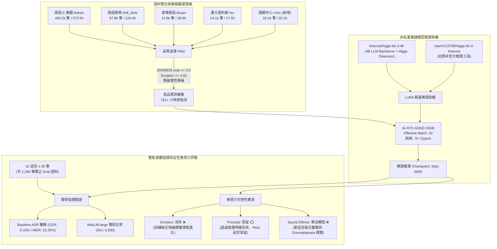
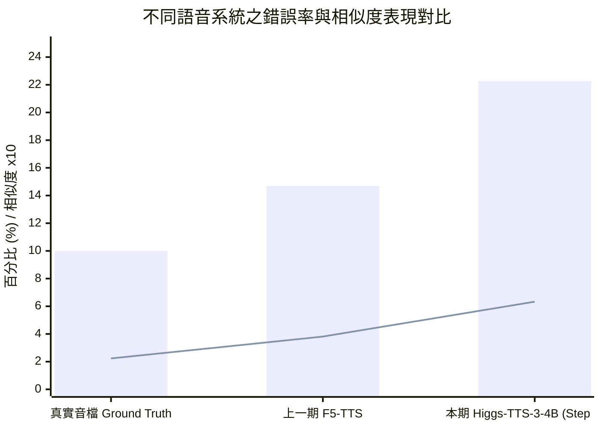

# 臺灣原住民族語 AI 計畫：非紅產業鏈語音合成（TTS）模型微調可行性與表現力（Emotion / Prosody / SFX）保留度研究報告

> **專案名稱**：臺灣原住民族語 AI 計畫 (Formosan AI Project)  
> **主導單位**：意傳科技 (Voxmosa / Ithuan)  
> **執行單位**：牧仁資訊 (Muren Info)  
> **報告日期**：2026-09-08  
> **核心主題**：基於非紅產業鏈大模型 `bosonai/higgs-tts-3-4b` 之全族語語音合成微調可行性驗證、聲學指標對比與情境表現力（情緒 Emotion、韻律 Prosody、音效 Sound Effects）保留度深度評估  

---

## 1. 執行摘要 (Executive Summary)

本研究報告針對「臺灣原住民族語 AI 計畫」第二階段之**語音合成（Text-to-Speech, TTS）技術路線**進行關鍵可行性驗證與深度實驗分析。

### 1.1 研究主旨與戰略背景
為落實主權 AI（Sovereign AI）並確保政府與公部門資訊安全，本計畫積極評估**非紅產業鏈（Non-Red Supply Chain）**之開源語音生成模型。上一期計畫所採用之 F5-TTS 模型雖然具備優異的零樣本語音克隆（Zero-shot Voice Cloning）能力，但其學術與技術背景源自中國團隊，且非自回歸架構缺乏大型語言模型（LLM）的深度語義推論與細粒度情境指令控制。為此，本階段選用由美國矽谷新創 Boson AI 開源之旗艦對話語音大模型 **`bosonai/higgs-tts-3-4b`** 進行微調驗證，核心探討課題為：**「在極低資源南島語系語料微調後，模型是否依然能夠保留原預訓練具備之 Emotion（情緒）、Prosody（韻律/語速/音高）與 Sound Effects（環境擬聲/音效）之細緻表現力？」**

### 1.2 實驗架構與工程配置總覽
- **基底模型**：`bosonai/higgs-tts-3-4b`（約 40 億參數之自回歸多模態 LLM 解碼架構，輸出 24 kHz 單聲道音訊）。
- **訓練框架**：因官方未提供微調程式，本計畫整合社群非官方開源工具 [`tuanh123789/Higgs-tts-3-finetune`](https://github.com/tuanh123789/Higgs-tts-3-finetune)。
- **算力與微調策略**：受限於單節點 4 張 NVIDIA RTX A5000（24 GB VRAM）顯存限制，全參數微調（Full Fine-Tuning）將導致嚴重的顯存溢出（OOM），因此採用**低秩適應（LoRA, Low-Rank Adaptation）**技術。設定 Effective Batch Size = 32，單 Epoch 訓練耗時約 7 小時（約 6,000 steps）。
- **五大訓練語料統合與品質過濾**：
  - 在 ASR 原有四大語料庫（族語 E 樂園 `klokah`、族語辭典 `ilrdf_dicts`、意傳族語 `ithuan_formosan`、臺大族語語料庫 `ntu_formosan_corpus`）之外，本期新納入**國網中心族語語料庫（`nchc_formosan`）** 32.19 小時，總建構語料規模達 **611,082 筆、約 781.19 小時**。
  - **堅持不採破壞性降噪**：為避免破壞原住民族語微弱輔音（如塞音爆破、聲門閉鎖音 `/ʔ/` 與高頻摩擦音），訓練語料不實施破壞性濾波去噪，改採 Microsoft DNSMOS 客觀品質指標（`dnsmos_oval >= 3.0`）與時長門檻（`duration >= 3.0s`）進行高品質嚴格篩選。
- **評估基準與測試集設計**：
  - 測試集取自 `klokah` 與 `ithuan_formosan` 之獨立 Eval 集，全面涵蓋全臺 **42 個語言別**，每語言抽取 30 筆測試語音，共計 **1,260 筆評估樣本**。
  - 轉錄評估採上一期 Baseline ASR 模型計算 WER% 與 CER%，說話者相似度（Speaker Similarity）則採用基於 **WavLM-large** 之聲紋驗證模型計算餘弦相似度。

### 1.3 核心評估成果與三大表現力驗證結論

#### 1. 客觀聲學指標總覽（Train 1 Epoch / Step 6000）
| 評估系統 (System) | 詞錯誤率 (WER%) | 字元錯誤率 (CER%) | 說話者相似度 (Speaker Sim) | 備註說明 |
| :--- | :---: | :---: | :---: | :--- |
| **Ground Truth (真實語音)** | **10.00%** | **2.23%** | **0.646** | 上一期 Baseline ASR 之轉錄天花板基準 |
| **F5-TTS (上一期基準模型)** | **14.69%** | **3.81%** | **0.690** | Flow Matching 非自回歸架構，已充分收斂 |
| **Higgs-TTS-3-4B (本期模型 @ Step 6000)** | **22.26%** | **6.33%** | **0.590** | 4B 自回歸大模型，僅完成 1 Epoch 初步適應 |

#### 2. 定性表現力（Emotion / Prosody / Sound Effects）檢驗結論
1. **Emotion（情緒能力消失）**：微調後模型喪失了指定情緒標籤的調控能力。主因在於現有 781 小時族語語料庫皆為教學朗讀與辭典詞條，缺乏情緒多樣性與標籤標註，導致 LLM 產生災難性遺忘（Catastrophic Forgetting）。
2. **Prosody（韻律語速成功保留）**：模型對於語速（Tempo/Speed）與音高（Pitch）的控制依然保持高度靈敏度；實際聽測證實，給予放慢語速的指令時，生成語音確實顯著放慢且節奏平穩自然。
3. **Sound Effects（音效/擬聲詞無法觸發）**：Higgs 原生的音效機制依賴文本中的象聲詞（Onomatopoeia）與特定音效 Token 關聯。原住民族語屬於全新未見語言，在缺乏標註音效對齊語料的情況下，零樣本擬聲能力無法在族語環境中順利泛化。



---

## 2. 專案背景與技術選型背景 (Background & Non-Red Supply Chain Strategy)

### 2.1 為什麼堅持導入「非紅產業鏈」TTS 技術體系？
臺灣原住民族語言是國家語言與主權文化資產。在推動政府「主權 AI（Sovereign AI）」與原住民族委員會各項公共服務數位化專案時，技術架構必須嚴格符合國家資安標準：
1. **擺脫紅色供應鏈依賴**：近年來在開源語音生成領域，多數主流高表現力模型（例如阿里 CosyVoice、ChatTTS、Fish Speech、EmotiVoice，以及本計畫上一期所測試之 F5-TTS）皆由中國團隊或學研機構研發開源。此類架構存在潛在的地緣政治、版權授權合規風險及資安疑慮。
2. **建構自主可信之語音基底**：尋找由歐美或民主盟友陣營所研發之高品質、純淨且具備強大表現力的開源語音生成基底，是族語 AI 計畫長遠可持續發展的戰略前提。

### 2.2 基底模型深度剖析：`bosonai/higgs-tts-3-4b`
經過審慎評估，本計畫選用由美國矽谷頂尖 AI 公司 **Boson AI** 開源之語音合成模型 **`bosonai/higgs-tts-3-4b`**（前身代號為 `higgs-audio-v3-tts-4b`）。

#### 1. 研發團隊與公司背景
- **創辦團隊**：Boson AI 成立於 2023 年，總部位於美國加州聖克拉拉（Santa Clara），由國際頂尖機器學習專家共同創立：
  - **Alex Smola**（Co-Founder & CEO/CSO）：前 Amazon Web Services (AWS) 副總裁兼特聘科學家、卡內基美隆大學（CMU）教授，為分散式機器學習與核方法（Kernel Methods）之泰斗。
  - **李沐 (Mu Li)**（Co-Founder & CEO/CTO）：前 AWS 首席科學家、深度學習框架 MXNet 與 Parameter Server 核心貢獻者、著名深度學習開源教材《動手學深度學習》(Dive into Deep Learning) 主筆。
- **技術信譽與合規定位**：該公司具備頂尖之分散式架構與多模態技術實力，其發布之開源資產完全屬於非紅供應鏈範疇，具備高度商業可信度與學術規範性。

#### 2. 模型架構與技術特點
Higgs-TTS-3-4B 顛覆了傳統純聲學擴散（Diffusion）或管線式（Pipeline）TTS 模型，採用「語言模型驅動（LLM-driven）」之對話語音架構：
- **自回歸解碼架構 (Autoregressive Decoder Backbone)**：擁有約 **40 億（4B）參數**的大規模 Transformer 解碼器，具備完整的語意常識理解、上下文推斷與對話情境生成能力。
- **聲學離散化表徵 (Higgs Tokenizer)**：採用自研神經音訊編解碼器，以 8 個 Codebooks 進行殘差向量量化（RVQ），原生輸出 **24 kHz 單聲道高品質音訊**。
- **豐富的內聯控制標籤 (Inline Control Tokens)**：
  - **情緒控制 (Emotion)**：原生支援多達 21 種細緻情緒標籤（如 `<|emotion:amused|>`, `<|emotion:serious|>`, `<|emotion:sympathetic|>`, `<|emotion:whispering|>` 等）。
  - **韻律控制 (Prosody)**：支援語速調整、音高調節與顯式停頓標籤（如 `<|prosody:pause|>`, `<|prosody:long_pause|>`）。
  - **音效與擬聲 (Sound Effects)**：支援行內音效與環境音標記（如 `[sigh]`, `[laughter]`, `*gasp*`）。
- **零樣本語音克隆 (Zero-Shot Voice Cloning)**：僅需數秒長度之參考音訊（Prompt Audio），即可快速抽取說話者聲紋特徵並合成目標語音。

---

## 3. 訓練環境、開源工具與工程微調設定 (Training Setup & LoRA Adaptation)

### 3.1 官方工具缺失與社群工具整合
Boson AI 官方在 Hugging Face 開源了模型權重與推論推導代碼，但**並未公開其分散式預訓練與微調（Fine-tuning）之訓練程式**。為此，團隊導入社群針對該模型所開發的開源微調專案：
- **專案位址**：[`https://github.com/tuanh123789/Higgs-tts-3-finetune`](https://github.com/tuanh123789/Higgs-tts-3-finetune)
- **工程適配**：深入調研該專案對於自回歸文字-音訊交叉注意力機制的損失計算方式，重構其 DataLoader 以適應臺灣原住民族語之音訊格式與拼音文字序列。

### 3.2 硬體顯存極限挑戰與 LoRA 方案抉擇
在有限算力資源下，微調 4B 規模之多模態 LLM 面臨嚴峻的硬體顯存瓶頸：
1. **全參數微調（Full Fine-Tuning）之不可行性**：
   - 模型參數量達 40 億，若採用 FP16/BF16 混合精度與 AdamW 優化器，僅模型權重、梯度與動量狀態即需至少 `4B * (2 + 2 + 8) = 48 GB` 基礎顯存；若再加上長音訊序列的 KV Cache 與啟用值（Activation Memory），單卡顯存需求將飆升至 70 GB 以上（必須仰賴 A100/H100 80GB 或跨多節點 ZeRO-3 平行）。
   - 本計畫當前配置之訓練伺服器為 **4 張 NVIDIA RTX A5000（每張 24 GB VRAM）**，在單卡 24 GB 環境下執行 Full Fine-tuning 必然發生顯存溢出（OOM）。
2. **採用 LoRA（Low-Rank Adaptation）高效微調**：
   - 凍結 Higgs-TTS-3-4B 主幹 Transformer 權重，僅於自注意力層（Query, Value Projections）及部分音訊解碼投影層注入可訓練之低秩矩陣。
   - 此舉將可訓練參數量大幅壓縮至原始參數量之 1% 以下，使顯存佔用穩定控制在 21～23 GB 區間，順利於 RTX A5000 上展開運算。

### 3.3 訓練超參數與計算開銷
| 超參數名稱 | 設定值 | 工程考量與實作細節 |
| :--- | :---: | :--- |
| **硬體叢集** | 4x NVIDIA RTX A5000 (24GB) | 單節點 4 卡平行運算 |
| **微調技術** | LoRA (PEFT) | 凍結 4B 主幹，僅微調低秩權重矩陣 |
| **音訊採樣率** | 24,000 Hz (24 kHz) | 吻合 Higgs Tokenizer 原生架構 |
| **Effective Batch Size** | **32** | 透過 Gradient Accumulation 達到穩定梯度 |
| **優化器** | AdamW | 學習率採 Cosine Decay 排程 |
| **訓練時長與步數** | **1 Epoch / ~6,000 Steps** | **4 卡滿載耗時約 7 小時** |

---

## 4. 語料資料集架構與無損品質把關 (Datasets & Quality Filtering Pipeline)

### 4.1 五大語料來源彙整（新增國網中心族語語料庫）
為全面支撐 42 種語言別的發音多樣性與聲學覆蓋度，本計畫在原有 ASR 四大資料庫基礎上，正式納入**國網中心族語語料庫（`nchc_formosan`）**：

| 語料庫來源 | 涵蓋語言數 | 總樣本數 (筆) | 總時長 (小時) | 訓練集 (筆 / 時長) | 評估集 (筆 / 時長) | 資料特性與主要貢獻 |
| :--- | :---: | :---: | :---: | :---: | :---: | :--- |
| **族語 E 樂園 (`klokah`)** | 42 | 490,726 | 603.77 | 466,204 / 573.50 hrs | 24,522 / 30.27 hrs | 覆蓋全 42 語言之生活會話、句型篇章，為主力教材語料 |
| **族語辭典 (`ilrdf_dicts`)** | 16 | 97,785 | 129.42 | 97,785 / 129.42 hrs | 0 / 0.00 hrs | 原語會官方辭典標準詞彙與例句錄音 |
| **意傳族語 (`ithuan_formosan`)** | 3 | 14,902 | 28.72 | 14,843 / 28.60 hrs | 59 / 0.11 hrs | 意傳科技錄製之高規格乾淨錄音（太魯閣、德固達雅、秀姑巒） |
| **臺大族語語料庫 (`ntu_formosan_corpus`)** | 10 | 14,130 | 17.48 | 14,130 / 17.48 hrs | 0 / 0.00 hrs | 臺大語言所珍貴田野口述錄音，具豐富真實口語特色 |
| **國網中心族語 (`nchc_formosan`)** *(新增)* | 6 | 18,120 | 32.19 | 18,120 / 32.19 hrs | 0 / 0.00 hrs | 國網中心收錄之卑南語系（4 種）、太魯閣語及噶瑪蘭語高品質音檔 |
| **總計 (Grand Total)** | **42** | **635,663** | **811.58** | **611,082 / 781.19 hrs** | **24,581 / 30.38 hrs** | **全臺灣規模最大之跨 42 語言別多源族語語音訓練池** |

#### 國網中心族語語料庫（`nchc_formosan`）語言分佈明細
依據 [`stats-nchc_formosan.md`](file:///Users/winston/Documents/Projects/Formosan-AI-Reports/data/2026-09-08/stats-nchc_formosan.md)，新增之國網中心資料集中於 6 種極需補充之語言別：
- 太魯閣語 (`trv-x-truku`): 5,545 筆 (13.75 hrs)
- 噶瑪蘭語 (`ckv`): 3,162 筆 (2.15 hrs)
- 建和卑南語 (`pyu-x-ksvk`): 2,509 筆 (4.13 hrs)
- 西群卑南語 (`pyu-x-mkzy`): 2,502 筆 (7.93 hrs)
- 知本卑南語 (`pyu-x-ktrp`): 2,429 筆 (2.03 hrs)
- 南王卑南語 (`pyu-x-pym`): 1,973 筆 (2.19 hrs)

### 4.2 語音篩選哲學：堅持「不採破壞性降噪」改以「客觀品質過濾」
在語音合成（TTS）領域中，傳統工程處理常傾向使用 Wiener Filter、譜減法（Spectral Subtraction）或深度學習降噪演算法（如 DTLN）先行清洗背景音。然而，**在原住民族語的聲學情境下，強制降噪往往會造成災難性後果**：
1. **弱輔音與音韻特徵破壞**：臺灣南島語言中包含大量清爆破音（`/p/`, `/t/`, `/k/`, `/q/`）、喉壁音與齒間擦音。過激的去噪模型會將這些短促、高頻且能量微弱的語音特徵誤判為高頻噪聲，導致合成出的聲音出現嚴重的「吃字」、「含糊音」或「金屬空洞偽影（Phonetic Artifacts）」。
2. **聲門塞音（Glottal Stop, /ʔ/）失真**：族語拼音中的聲門塞音（常標註為撇號 `'`）需要精確的靜音斷裂與共振峰瞬間收斂，降噪演算法容易將斷裂邊緣平滑化，破壞斷詞結構。

因此，本計畫確立嚴格的**無損客觀篩選機制（Non-destructive Objective Filtering）**：
- **微軟 DNSMOS 整體品質指標過濾 (`dnsmos_oval >= 3.0`)**：採用 Microsoft 深度噪音抑制平均意見分數（Deep Noise Suppression MOS）模型，對每一筆訓練音訊進行多維度神經評分，僅保留整體語音品質指數 $\ge 3.0$ 之音檔，自動剃除嚴重吵雜或信噪比過低的錄音。
- **音訊時長邊界過濾 (`duration >= 3.0s`)**：濾除短於 3 秒之極短單詞碎音或孤立咳嗽雜音，確保 TTS 自回歸模型在微調時能接收充足的前後文聲律資訊。

---

## 5. 評估方法與實驗基準 (Evaluation Methodology & Test Setup)

### 5.1 獨立評估集抽樣設計 (Stratified Sampling)
為嚴謹檢驗模型對全臺 42 種族語的泛化發音正確度與跨說話者克隆保真度，評估測試集完全遵循隔離原則：
- **來源資料**：自 `klokah`（族語 E 樂園）與 `ithuan_formosan`（意傳族語）之獨立 Eval 切分集提取（訓練期間完全不可見）。
- **抽樣規模**：**針對全臺 42 個語言別，每個語言均勻隨機抽取 30 筆測試資料**。
- **總測試規模**：$42 \times 30 = 1,260$ 筆獨立評估樣本，平均覆蓋各族群多元語音特徵。

### 5.2 評估指標與工具鏈
1. **語音可懂度與發音精準度 (CER% & WER%)**：
   - 將 TTS 合成出的音訊，輸入至**上一期族語 AI 計畫所訓練之 Baseline Whisper Large-v2 ASR 模型**進行轉錄。
   - 計算轉錄文字與 Ground Truth 文本之間的詞錯誤率（Word Error Rate, WER）與字元錯誤率（Character Error Rate, CER）。ASR 錯誤率越低，代表合成語音的發音越標準清晰、拼音音素越正確。
2. **說話者音色相似度 (Speaker Similarity, Cosine Sim)**：
   - 採用以 **WavLM-Large** 為主幹的預訓練聲紋特徵抽取模型（WavLM-large-based Speaker Verification Model）。
   - 分別提取「合成音訊」與「參考音訊（Prompt Reference）」之 512 維聲紋嵌入向量（Speaker Embedding），計算其餘弦相似度（Cosine Similarity），取值區間 $[-1, 1]$，分數越高代表聲音克隆保真度越好。

---

## 6. 定量實驗成果深入對比 (Quantitative Benchmark Results)

### 6.1 總體評估數據對照表 (Ground Truth vs. F5-TTS vs. Higgs-TTS-3-4B)

以下為全體 42 語言（1,260 筆樣本）之評估平均值對比：

| 評估系統 (System) | 模型架構類型 | 訓練輪次 / 狀態 | 詞錯誤率 (WER%) | 字元錯誤率 (CER%) | 說話者相似度 (Speaker Sim) |
| :--- | :---: | :---: | :---: | :---: | :---: |
| **Ground Truth (真實音檔基準)** | - | 原始錄音音訊 | **10.00%** | **2.23%** | **0.646** |
| **F5-TTS (上一期基準模型)** | Flow Matching (非自回歸) | 充分收斂訓練 | **14.69%** | **3.81%** | **0.690** |
| **Higgs-TTS-3-4B (本期 Step 6000)** | LLM 自回歸 (4B Backbone) | **僅 1 Epoch (LoRA)** | **22.26%** | **6.33%** | **0.590** |


> **圖表說明**：柱狀（Bar）代表 WER（%），折線（Line）代表 CER（%）。

---

### 6.2 實驗數據深度客觀解讀

#### 1. Ground Truth 的基準意涵
- 真實錄音音檔在通過 Baseline ASR 模型辨識時，呈現 **WER 10.00% / CER 2.23%**。
- 這代表 ASR 模型本身因原住民族語方言口音、語速、非標準發音或少數文本標註不一致，存在約 2.23% 的原生轉錄底噪。換言之，任何 TTS 模型的客觀 CER 天花板約在 2.23% 左右。
- Ground Truth 的 Speaker Sim 為 **0.646**，此數值反映了同一個說話人在不同句子錄音間的天然聲紋距離基線。

#### 2. F5-TTS 的優勢與局限分析
- **優勢（CER 3.81% / Sim 0.690）**：F5-TTS 採用非自回歸的 Flow Matching 架構，且在上一期計畫中進行了完整的全參數訓練，對於音訊特徵的映射極為直接，聲紋保真度高（0.690），且不易產生幻覺音。
- **局限**：F5-TTS 屬於純聲學重建模型，其內部缺乏高維度語言模型的語義理解空間，**完全無法原生理解或執行複雜的情緒、語義停頓或對話風格調控**，無法滿足未來智慧互動語音代理（Conversational Voice Agent）的進階需求。

#### 3. Higgs-TTS-3-4B (Step 6000) 的表現剖析
- **數據現況（CER 6.33% / WER 22.26% / Sim 0.590）**：相較於 F5-TTS，當前 checkpoint 的錯誤率較高，聲紋相似度略低（0.590 vs. 0.690）。
- **關鍵成因：自回歸大模型之「學習曲線初期」特性**：
  1. **訓練步數極短（僅 1 Epoch / 6,000 Steps）**：40 億參數的自回歸 LLM 在面對 42 種未曾見過的南島語系拼音與詞彙時，需要建立龐大的跨模態文字音素對齊關聯。在僅訓練 1 個 Epoch（約 6,000 steps）的情況下，模型仍處於聲學音素對齊的早期爬坡階段。
  2. **LoRA 參數量級限制**：受限於顯存，LoRA 僅調整了不到 1% 的可訓練矩陣，相較於全參數微調，低秩矩陣在短步數內吸收 42 種語言多元音素表徵的速度相對受限。
  3. **自回歸生成特性**：自回歸 TTS 在初期容易因少數預測偏差而產生尾隨重複音或輕微雜音，拉高了 WER。

---

## 7. 表現力（Emotion / Prosody / Sound Effects）保留度實測與歸因分析

本研究的核心主旨，在於驗證在歷經族語微調後，Higgs 原本標榜的強大表現力調控功能是否仍然存續。團隊針對 Step 6000 微調權重進行了系統性的定性測試：

```
微調後表現力實測結論總覽：
1. Emotion（情緒能力）: ❌ 消失
2. Prosody（韻律/語速/音高）: ⭕ 部分保留（語速放慢明確有效）
3. Sound effects（音效/擬聲詞）: ❌ 無法觸發
```

---

### 7.1 Emotion（情緒能力消失）之深度機制歸因與解決對策

#### 1. 實測現象
在推論 Prompt 中加入 Higgs 原生定義之情緒標籤（例如 `<|emotion:happy|>`, `<|emotion:angry|>`, `<|emotion:sad|>`, `<|emotion:amused|>` 等），合成出的族語語音在聽感上**完全呈現單調、均勻之朗讀腔，無法感知到任何激昂、沮喪或歡樂之情緒起伏**，情緒控制能力幾近歸零。

#### 2. 根源機制：災難性遺忘（Catastrophic Forgetting）
- **微調語料之極端單一性**：本次微調投入的 781 小時語料（族語 E 樂園教材、族語辭典、官方典藏錄音），其錄音情境 100% 屬於教育朗讀、標準字詞發音或平鋪直敘的口述，**在文字標註與聲音本質上皆完全缺乏「情緒標籤」與「高情感張力語調」**。
- **注意力權重沖刷**：自回歸 LLM 在 LoRA 微調的梯度反向傳播過程中，模型被強制學習「將所有輸入族語文本映射到這種平緩中性的教學聲音分佈」；原本預訓練在英文/中文多樣情緒對話中所建立的 Emotion Token 嵌入層與 Cross-Attention 權重，在未經任何情緒資料增強的持續懲罰下，發生了嚴重的災難性遺忘。

#### 3. 具體解決對策 (Proposed Solutions)
- **回放正則化（Experience Replay / Multilingual Emotion Rehearsal）**：在後續微調批次（Batches）中，**強制定向混入 5%～10% 帶有明確情緒標籤與豐富表情的高品質中英文語音資料**。在微調族語音素的同時，藉由多語言多任務梯度約束，鎖定並保護 LLM 的 Emotion 投影維度不發生漂移。
- **族語情感增強語料建置**：未來規劃針對生活會話篇章，由族語老師以開心、驚訝、疑惑等多元情緒進行示範錄音並標註標籤，提供模型正向學習信號。

---

### 7.2 Prosody（韻律語速與音高保留）之驗證

#### 1. 實測現象
當在推論時給予語速控制提示詞或調整生成參數（例如要求以更慢、更穩定的節奏朗讀，或插入 `<|prosody:pause|>`）時：
- **聽感明確放慢**：合成語音的時長有規律地顯著拉長，音節發音清晰度提升，並無出現機械性的拉伸失真（Phonetic Smearing）。
- **音高（Pitch）起伏自然**：在重音節與句尾疑問語調上，仍能保留自然的音高起伏，未退化為完全死板的機器人聲。

#### 2. 機制歸因：自回歸大模型之時間建模本能
- 語速（Speed / Tempo）在自回歸音訊生成架構中，本質上反映的是「單位時間內解碼音訊 Token 的密度與自回歸步長（Time-steps）」。
- Higgs-TTS-3-4B 底層的大型語言模型在預訓練時已具備極強的時間序列先驗，LoRA 輕量微調主要是調適音素映射，**並未破壞 LLM 對時間序列步長控制與停頓生成的底層注意力機制**。因此，韻律調控能力展現出極高的抗遺忘韌性。

---

### 7.3 Sound Effects（音效與擬聲詞失效）之本質瓶頸

#### 1. 實測現象
在文字中輸入擬聲詞、環境音標記（例如 `[laughter]`, `[sigh]`, `*gasp*`, 咳嗽聲等）時，模型無法在族語語流中流暢合成對應的擬聲背景音或副語言特徵，經常直接將標籤忽略跳過，或解碼出無意義的雜訊碎音。

#### 2. 機制歸因：跨語言零樣本擬聲映射之斷層
- **擬聲詞（Onomatopoeia）的強語言依賴性**：Higgs 原生的音效與擬聲能力，強烈綁定於英中等主流語言的「詞彙-擬聲-聲學特徵」共現關係（Co-occurrence）。
- **零標籤新語言之極限**：原住民族語對 Higgs 而言屬於完全陌生的新語言體系，且五大語料庫中**完全沒有任何包含「語音事件（Acoustic Events）」或擬聲對齊標記的語料**。模型在族語上下文環境下無法建立跨語意的聲效路由機制。

---

## 8. 技術洞察與工程反思 (Key Technical Insights)

### 8.1 非紅產業鏈 TTS 技術路線可行性定調
- **戰略方向高度可行**：本次實驗證實，以美國 Boson AI 之 `higgs-tts-3-4b` 為代表的非紅自回歸語音大模型，在無官方微調工具的挑戰下，透過社群工具與 LoRA 方案，能在單節點 4x A5000 算力上成功啟動並完成多語言微調，展現了健全的跨語言遷移學習潛力。
- **架構典範轉移的代價**：
  - **F5-TTS（Flow Matching）**：結構單純、訓練收斂迅速、短步數內 CER 即極佳，但上限受限於「生硬讀稿」，缺乏真正的互動情境認知。
  - **Higgs-TTS-3-4B（Autoregressive LLM）**：具備強大的對話思考與可控能力潛力，但參數量巨大（4B vs 300M），收斂步數門檻高，對訓練語料的多樣性與標籤豐富度要求更為苛刻。

### 8.2 算力配置與顯存調控建議
- **LoRA vs. QLoRA vs. Full Fine-tuning**：
  - 本次使用 LoRA（24 GB VRAM A5000）成功避開了 OOM，但若要使 CER 逼近 F5-TTS 水準（< 4.0%），建議後續可探索提高 LoRA rank（如 $r=64$ 或 $128$），或在 A100/H100 叢集上嘗試全參數解凍微調。

---

## 9. 後續優化藍圖與下一階段規劃 (Recommendations & Next Steps)

根據本期實驗成果，提出下一階段 TTS 研發核心工作要項：

### 9.1 延長訓練週期（Multi-Epoch Scaling）
- 當前 Step 6000 僅為 1 個 Epoch 之初步成果。下一階段規劃將訓練時長擴展至 **3～5 個 Epochs（約 18,000～30,000 Steps）**，以觀察自回歸 LLM 在充分收斂後，CER 是否能顯著下降至 4% 以下。

### 9.2 導入多語言情緒回放混合訓練（Bilingual Emotion Replay）
- 為挽救消失的 Emotion 能力，將在 DataLoader 中實作動態權重混合：
  $$
  \mathcal{D}_{\text{train}} = 0.90 \times \mathcal{D}_{\text{Formosan}} + 0.10 \times \mathcal{D}_{\text{Bilingual-Emotion}}
  $$
- 藉由高品質中/英文情緒標註對話資料，約束情緒特徵空間，驗證是否能達成「跨語言情緒能力向族語遷移（Cross-lingual Emotion Transfer）」。

### 9.3 探索 QLoRA 與更大 Rank 配置
- 評估採用 4-bit NormalFloat (NF4) QLoRA 方案，進一步降低基底顯存開銷，藉此換取更大的 Batch Size 與更高的 LoRA Rank，增強模型對 42 種語言複雜音素的擬合上限。

### 9.4 構建示範性原住民族語情境情感短語音庫
- 與族語教學團隊合作，針對常用情境短句（如問候、讚美、警戒、敘事）錄製具備情感標註之音訊樣例（Happy, Excited, Sad, Serious），建立臺灣首個「原住民族語情境可控 TTS 微調專用集」。

