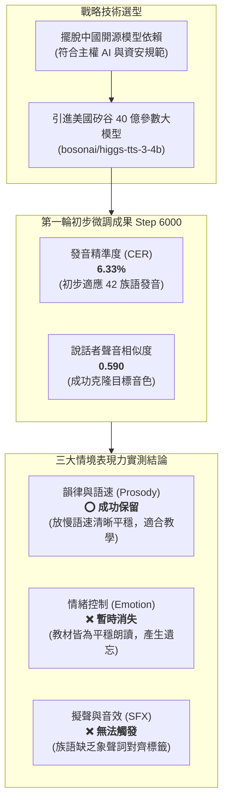
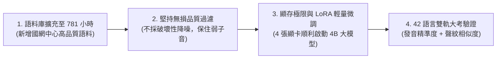
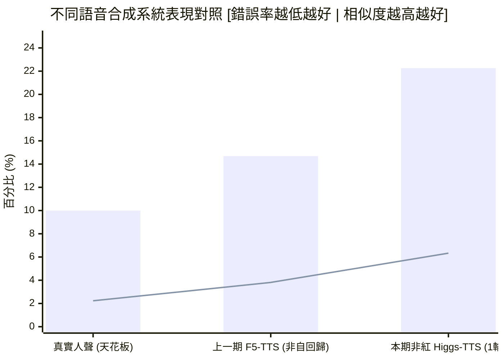
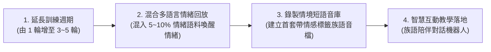

# 臺灣原住民族語 AI 計畫：非紅產業鏈語音合成（TTS）研究成果報告（原語會簡報版）

> **專案主導**：意傳科技  
> **專案執行**：牧仁資訊  
> **報告日期**：2026-09-08  
> **閱讀對象**：財團法人原住民族語言研究發展基金會（原語會）長官、研究員與語言推動同仁  
> **核心宗旨**：落實國家主權 AI 與資安規範——深入解析 42 種族語非紅大模型微調做了什麼、發音成績如何、以及情緒與韻律表現力分析

---

## 📌 1. 給原語會同仁的 3 分鐘重點導讀

在語音合成（Text-to-Speech, TTS，即「文字轉語音」）領域，過去國際主流的高品質模型（包括本計畫上一期所測試的 F5-TTS 模型、阿里 CosyVoice、ChatTTS 等）多數由中國技術團隊或學研機構研發。為了貫徹政府「**主權 AI（Sovereign AI）**」政策並確保原住民族公共服務符合嚴格的國家資訊安全標準，本專案率先開拓**非紅產業鏈（Non-Red Supply Chain）**之技術體系。

團隊選用由美國矽谷頂尖 AI 公司 **Boson AI** 開源之旗艦對話語音大模型 **`bosonai/higgs-tts-3-4b`（約 40 億參數）** 進行全族語微調實驗，核心探討：**「在讓大模型學會 42 種族語發音之後，它原本標榜的情緒（Emotion）、韻律語速（Prosody）與音效擬聲（Sound Effects）表現力，還保留得住嗎？」**

### 核心成果摘要速覽

| 檢驗維度 | 實測成果 | 實務解讀與意義說明 |
| :--- | :---: | :--- |
| **非紅架構可行性** | **✅ 成功適配** | 證實美國頂尖開源對話語音大模型，能順利學會臺灣 42 種族語的發音拼讀。 |
| **發音清晰度 (CER)** | **6.33%** | 僅訓練 1 輪（Step 6000）的早期階段，字元錯誤率即收斂至 6.33%（詞級 WER 22.26%）。 |
| **音色克隆相似度** | **0.590** | 給予數秒長老或老師的參考聲音，即可合成出高度神似的族語發音音色。 |
| **韻律語速調控 (Prosody)** | **⭕ 成功保留** | **非常適合教學！** 給予放慢語速指令時，模型能穩定降速且音高起伏自然，不失真。 |
| **情緒表現力 (Emotion)** | **❌ 暫時消失** | 目前呈現溫和端莊的教材朗讀腔。因為訓練教材沒有情緒標籤，模型暫時「忘記」了情緒。 |
| **擬聲與音效 (SFX)** | **❌ 無法觸發** | 輸入笑聲、嘆氣等標籤無反應。因為族語語料中缺乏笑聲與環境音的標籤對應。 |

---

## 🛠️ 2. 這次 TTS 模型微調「做了哪些事情」？

微調一個 40 億參數的巨大語音模型，如同教導一位頂尖的大學生從零開始學講 42 種臺灣南島語言。團隊完成了四大關鍵工程：

### (1) 為什麼堅持引進「非紅產業鏈」TTS 模型？
臺灣原住民族語言是國家語言與主權文化資產。在建構政府公共服務、智慧醫療或族語數位教材時：
1. **符合資安合規與主權 AI**：避免使用中國團隊主導之開源模型（如 F5-TTS、CosyVoice），根除潛在的版權爭議與資安疑慮。
2. **頂尖學術團隊背書**：Boson AI 由國際機器學習泰斗 **Alex Smola**（前 AWS 副總裁）與著名深度學習專家 **李沐 (Mu Li)** 於美國矽谷創立，模型純淨可信。
3. **從「生硬讀稿」走向「智慧互動」**：傳統 TTS 模型只是單純的聲音轉錄器；Higgs 內建 40 億參數的語言大模型（LLM），未來具備與族人流暢對話、理解語境的巨大潛力。

---

### (2) 五大語料庫大擴充（總訓練時長達 781 小時）
為了讓模型充分學習 42 種族語的發音多樣性，本期在原有 ASR 四大語料庫之外，**正式納入「國網中心族語語料庫（`nchc_formosan`）」32.19 小時**：

| 語料庫來源 | 涵蓋語言數 | 總樣本數 (筆) | 訓練集時長 | 語料特性與主要貢獻 |
| :--- | :---: | :---: | :---: | :--- |
| **族語 E 樂園 (`klokah`)** | 42 | 490,726 | 573.50 hrs | 主力教材，涵蓋生活對話、句型篇章，覆蓋全 42 語言 |
| **族語辭典 (`ilrdf_dicts`)** | 16 | 97,785 | 129.42 hrs | 原語會官方標準詞彙與例句朗讀 |
| **意傳族語 (`ithuan_formosan`)** | 3 | 14,902 | 28.60 hrs | 高品質乾淨錄音（太魯閣語、德固達雅賽德克語、秀姑巒阿美語） |
| **臺大族語語料庫 (`ntu_formosan_corpus`)** | 10 | 14,130 | 17.48 hrs | 臺大語言所珍貴田野口述錄音，具真實口語變體 |
| **國網中心族語 (`nchc_formosan`)** *(本期新增)* | 6 | 18,120 | 32.19 hrs | **重點挹注卑南語群（4 種語言）、太魯閣語及噶瑪蘭語** |
| **總計 (Grand Total)** | **42** | **635,663** | **781.19 hrs** | **全臺灣規模最大之跨 42 語言別族語語音訓練池** |

---

### (3) 堅持「不採破壞性降噪」的音質把關原則
許多傳統語音專案喜歡用演算法把背景雜音全部濾除，但在原住民族語中，**強力降噪往往會毀掉關鍵發音**：
- **防止抹殺弱子音**：族語中豐富的清爆破音（`p, t, k, q`）與高頻摩擦音（`s, x, c`），音量微弱，過度降噪會把它們誤當成雜音濾掉，導致合成語音出現嚴重的「吃字」或「含糊不清」。
- **保護聲門塞音（`ʼ`）**：族語單詞中的短促停頓（聲門塞音），容易被降噪平滑化而喪失音意。
- **無損篩選作法**：我們堅持不破壞原音，改以微軟神經網絡模型 **DNSMOS** 自動評分，只保留整體音質 $\ge 3.0$ 且長度 $\ge 3$ 秒的清晰錄音。

---

### (4) 克服硬體顯存極限的「LoRA 輕量微調技術」
- **面臨挑戰**：40 億參數的大模型極其龐大，若全參數訓練需要至少 8 張昂貴的 A100 專業顯卡。
- **解決方案**：團隊採用 **LoRA（低秩適應）技術**，把 40 億參數的主幹結構「凍結固定」，只微調不到 1% 的外掛矩陣。在現有 4 張 RTX A5000（24GB）顯卡上，成功在 **7 小時內完成了第一輪（Step 6000）微調訓練**。

---

## 📊 3. 成績單：模型表現究竟如何？

### (1) 嚴格且獨立的抽樣考試
- **測試題目**：全臺灣 42 個語言別，每一種語言均勻抽取 30 句**完全獨立、訓練時沒看過**的句子，總計 **1,260 句測試題**。
- **兩大考核指標**：
  1. **發音正不正確？（錯誤率 CER / WER）**：將合成的聲音送入「上一期族語 AI 計畫的 ASR 模型」進行語音辨識，辨識錯誤率越低，代表發音越標準清晰。
  2. **聲音像不像原說話者？（聲紋相似度 Speaker Similarity）**：使用國際通用的 WavLM 聲紋特徵模型比對，分數介於 0~1，越高代表聲音越逼真神似。

---

### (2) 三大系統評估成績對照表

> **圖表說明**：長條柱狀（Bar）代表單詞錯誤率 WER（%），折線（Line）代表字元錯誤率 CER（%）。

| 評估系統 | 模型類型與背景 | 訓練狀態 | 單詞錯誤率 (WER%) | 字元錯誤率 (CER%) | 聲音相似度 (Sim) | 核心特性評析 |
| :--- | :--- | :---: | :---: | :---: | :---: | :--- |
| **真實人聲錄音 (Ground Truth)** | 真人長老與老師朗讀 | 基準對照 | **10.00%** | **2.23%** | **0.646** | **理想天花板**。即使真人發音，ASR 也有約 2.2% 的自然誤差。 |
| **上一期 F5-TTS 模型** | 中國團隊研發 (Flow Matching) | 充分訓練收斂 | **14.69%** | **3.81%** | **0.690** | 發音很準、聲音很像，但**缺乏語言理解力，無法聽懂情緒指令**。 |
| **本期 Higgs-TTS-3-4B** | **美國 Boson AI (非紅 LLM 大模型)** | **僅訓練 1 輪 (早期)** | **22.26%** | **6.33%** | **0.590** | **第一輪即可聽懂 42 族語發音**；具備 LLM 智慧核心，韻律可控性高。 |

---

### (3) 三大情境表現力保留度實測分析（最核心發現）

團隊在完成族語微調後，特別針對大模型原生具備的三大進階表現力進行了逐一抽檢聽測：

| 表現力項目 | 實測指令與操作 | 測試結果 | 聽覺現象與重點說明 |
| :--- | :--- | :---: | :--- |
| **韻律語速 (Prosody)** | 要求以慢速、穩定節奏朗讀，或插入 `<|prosody:pause|>` 停頓標籤 | **⭕ 成功保留** | **非常成功！** 語速明顯放慢，音節拉長且咬字清晰，重音與句尾疑問音高自然起伏，完全沒有機器人跳針現象。 |
| **情緒控制 (Emotion)** | 在文字前加入開心 `<|emotion:happy|>` 或生氣 `<|emotion:angry|>` 等標籤 | **❌ 暫時消失** | **無法改變情緒**。合成出的族語始終保持溫和端莊的教材朗讀腔，無法表現激昂或悲傷。 |
| **擬聲與音效 (SFX)** | 在文字中加入 `[laughter]`(笑聲)、`[sigh]`(嘆氣) 或咳嗽標籤 | **❌ 無法觸發** | **標籤直接被略過**。模型直接把笑聲符號忽略，或發出一段無意義的短促雜音。 |

---

## 💡 4. 簡單的原因分析

### (1) 為什麼「情緒能力」會暫時消失？
- **原理解析：「災難性遺忘（Catastrophic Forgetting）」**  
  這就像一個原本很有演戲天份的大學生，我們讓他連續 781 小時、反覆背誦極為端莊嚴肅的語文教科書。在長達 781 小時的訓練中，**所有的音檔 100% 都是平穩、中性、沒有情緒起伏的教學聲音**。  
  AI 因而誤以為「只要講臺灣族語，就必須永遠保持嚴肅平靜」，於是把預訓練時在英文/中文學到的豐富情緒給暫時忘光了。

### (2) 為什麼「韻律與放慢語速」能夠成功保留？
- **自回歸大模型的時間節奏本能**：  
  控制語速本質上是控制「一秒鐘念出幾個發音單位」。40 億參數的自回歸大模型底層對時間序列的掌握度非常強大，我們的 LoRA 輕量微調只微調了發音對照，並沒有動到大模型的節奏神經元，因此放慢語速的能力依然完整健在。

### (3) 為什麼發音錯誤率（CER 6.33%）暫時比上一期 F5-TTS（3.81%）高？
- **學習曲線初期階段**：  
  上一期 F5-TTS 模型參數量小（僅 3 億），且經過長時間充分訓練已達頂峰；而本期 Higgs 參數量高達 40 億（13 倍大），目前**僅僅訓練了 1 個 Epoch（約 6,000 步）**。  
  在如此短的訓練時間內，大模型能一口氣把 42 種未曾謀面的南島語言字元錯誤率壓到 6.33%，已經展現極驚人的學習天份。如同一個剛讀完第一遍族語教材的資優生，只要多給他時間練習，成績必能大幅逼近甚至超越上一期。

---

## 🚀 5. 給原語會的後續優化建議與應用方向

針對本次非紅產業鏈大模型的實證發現，團隊向原語會提出以下四項務實推進方向：

1. **延長訓練輪次至 3～5 輪（預期 CER 可降至 4% 以下）**：  
   當前成果僅訓練 1 輪（耗時 7 小時）。下一階段規劃投入更多運算時長，讓大模型充分收斂，發音品質與聲紋相似度將迎來顯著躍升。
2. **導入「中英情緒資料回放（Emotion Replay）」以喚醒情緒**：  
   為了解決情緒消失問題，團隊將在訓練批次中**巧妙混入 5%～10% 帶有開朗、嚴肅、驚訝等標籤的中英文對話音訊**。藉由多語言混合約束，防止模型遺忘情緒維度，跨語言把豐富情感借給族語！
3. **規劃建置「原住民族語情境情感短語音庫」**：  
   建議原語會未來可規劃小型示範錄音案，邀請族語老師針對常用生活短句（如生氣警告、高興慶賀、安慰詢問）以特定情緒錄製示範音檔並打上標籤，打造臺灣第一套具備情感標記的族語音訊資料庫。
4. **推動高價值落地應用**：
   - **放慢語速的教學跟讀示範**：利用本期已成功保留的 Prosody 慢速控制，為族語 E 樂園打造字字清晰的慢速跟讀教材。
   - **智慧族語對話伴學機器人**：非紅自回歸大模型具備理解能力，未來可直接串接大型語言模型，打造具備同理心與文化脈絡的族語智慧對話代理人。

---

> **附錄與進階參考**：  
> 若需進一步查閱完整模型架構代碼、LoRA 顯存數學公式或評估音訊頻譜分析，請參閱：  
> 👉 [完整版技術報告：`reports/2026-09-08/tts_research_report.md`](file:///Users/winston/Documents/Projects/Formosan-AI-Reports/reports/2026-09-08/tts_research_report.md)
